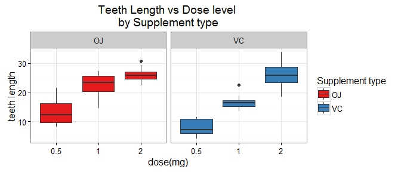
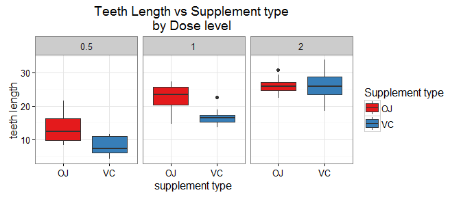

# Stat.Inf. Project, part2
Pranav Narula 
October 24th, 2021  

---

####Instructions

* Load the ToothGrowth data and perform some basic exploratory data analyses

* Provide a basic summary of the data.

* Use confidence intervals and/or hypothesis tests to compare tooth growth by supp and dose. (Only use the techniques from class, even if there's other approaches worth considering)

* State your conclusions and the assumptions needed for your conclusions.

---

###Exploratory data analysis

First, we load the required packages and the dataset


```r
#Load required packages
library(dplyr, warn.conflicts = F)
library(ggplot2)
library(ggthemes)

#Load data and convert to tbl format
ToothGrowth <- tbl_df(ToothGrowth)
```

We take a look at the structure of our dataset and summarize the variables it contains


```r
#Structure of the dataframe
ToothGrowth %>% str()
```

```
## Classes 'tbl_df', 'tbl' and 'data.frame':	60 obs. of  3 variables:
##  $ len : num  4.2 11.5 7.3 5.8 6.4 10 11.2 11.2 5.2 7 ...
##  $ supp: Factor w/ 2 levels "OJ","VC": 2 2 2 2 2 2 2 2 2 2 ...
##  $ dose: num  0.5 0.5 0.5 0.5 0.5 0.5 0.5 0.5 0.5 0.5 ...
```

```r
#Summary
ToothGrowth %>% summary()
```

```
##       len        supp         dose      
##  Min.   : 4.20   OJ:30   Min.   :0.500  
##  1st Qu.:13.07   VC:30   1st Qu.:0.500  
##  Median :19.25           Median :1.000  
##  Mean   :18.81           Mean   :1.167  
##  3rd Qu.:25.27           3rd Qu.:2.000  
##  Max.   :33.90           Max.   :2.000
```

So we have a dataset of 60 observations of 3 variables:

* **len**: tooth length, numeric variable
* **supp**: supplement type (VC:vitamin c or OJ:orange juice), factor variable
* **dose**: dose(in milligrams), numeric variable


```r
#Unique values in the dose vector
ToothGrowth %>% select(dose) %>% unique()
```

```
## # A tibble: 3 x 1
##    dose
##   <dbl>
## 1   0.5
## 2   1.0
## 3   2.0
```

The numeric variable _dose_ contains only 3 unique values: 0.5, 1, 2. We can conveniently convert it to a factor variable with three levels


```r
#Convert to factor
ToothGrowth <- ToothGrowth %>% mutate(dose = as.factor(dose))
```

####Plots


```r
ToothGrowth %>%
ggplot(aes(x=dose, y=len, fill = supp)) +
geom_boxplot() +
facet_grid(. ~ supp) +
scale_fill_brewer(palette = "Set1") +
theme_bw() +
ggtitle("Teeth Length vs Dose level \nby Supplement type") +
labs(x="dose(mg)", y= "teeth length ") +
guides(fill=guide_legend(title="Supplement type"))
```

<!-- -->

This multipanel plot emphasizes the relationship between teeth length and dose level for each supplement type. It appears to be a positive relationship for both supplement types. In other words, as the amount of supplement increases, so does teeth length.


```r
ToothGrowth %>%
ggplot(aes(x = supp, y = len)) +
geom_boxplot(aes(fill = supp)) +
facet_wrap(~ dose) +
scale_fill_brewer(palette = "Set1") +
theme_bw() +
ggtitle("Teeth Length vs Supplement type \nby Dose level ") +
labs(x="supplement type", y= "teeth length ") +
guides(fill=guide_legend(title="Supplement type"))
```

<!-- -->

This second plot shows the relationship between supplement type and teeth length emphasizing direct comparison between supplement types. Here the relationship is much less clear. Orange juice OJ appears to be more effective at dosage levels 0.5 and 1. On the other hand, at dosage level 2 there doesn't appear to be any significative difference.


```r
ToothGrowth  %>% filter(dose == 2)  %>% group_by(supp)   %>%  summarise(avg.length = mean(len))
```

```
## # A tibble: 2 x 2
##     supp avg.length
##   <fctr>      <dbl>
## 1     OJ      26.06
## 2     VC      26.14
```

Actually, as we can see, at dosage level 2, VC appears to be slightly more effective than OJ, with an average teeth length of 26.14 vs 26.06

###Hypothesis Tests 

Now we want to further compare teeth growth by supplement type and dose levels. This time we'll use statistical tests, t-test. As seen before, in our dataset we have two levels for supp: OJ and VC and three levels for dose: 0.5, 1, 2. Thus we'll have to run one hypothesis test for factor _supp_ and one for each possible pair of the 3 levels in the factor _dose_, that is, we will run a total of 4 tests. We start by 

**Testing by dose levels**

* #####Test A, dose = 0.5 and dose = 1


```r
#Exract the len and dose vectors from the df ToothGrowth
len_a <- ToothGrowth %>% filter(dose %in% c(0.5,1)) %>% select(len) %>% unlist()
dose_a <- ToothGrowth %>% filter(dose %in% c(0.5,1)) %>% select(dose) %>% unlist()
#Test
(Test.a <- t.test(len_a~dose_a, paired = FALSE))
```

```
## 
## 	Welch Two Sample t-test
## 
## data:  len_a by dose_a
## t = -6.4766, df = 37.986, p-value = 1.268e-07
## alternative hypothesis: true difference in means is not equal to 0
## 95 percent confidence interval:
##  -11.983781  -6.276219
## sample estimates:
## mean in group 0.5   mean in group 1 
##            10.605            19.735
```

* #####Test B, dose = 0.5 and dose = 2


```r
#Exract the len and dose vectors from the df ToothGrowth
len_b <- ToothGrowth %>% filter(dose %in% c(0.5,2)) %>% select(len) %>% unlist()
dose_b <- ToothGrowth %>% filter(dose %in% c(0.5, 2)) %>% select(dose) %>% unlist()
#Test
(Test.b <- t.test(len_b~dose_b, paired = FALSE))
```

```
## 
## 	Welch Two Sample t-test
## 
## data:  len_b by dose_b
## t = -11.799, df = 36.883, p-value = 4.398e-14
## alternative hypothesis: true difference in means is not equal to 0
## 95 percent confidence interval:
##  -18.15617 -12.83383
## sample estimates:
## mean in group 0.5   mean in group 2 
##            10.605            26.100
```

* #####Test C, dose = 1 and dose = 2


```r
#Exract the len and dose vectors from the df ToothGrowth
len_c <- ToothGrowth %>% filter(dose %in% c(1,2)) %>% select(len) %>% unlist()
dose_c <- ToothGrowth %>% filter(dose %in% c(1,2)) %>% select(dose) %>% unlist()
#Test c
(Test.c <- t.test(len_c~dose_c, paired = FALSE))
```

```
## 
## 	Welch Two Sample t-test
## 
## data:  len_c by dose_c
## t = -4.9005, df = 37.101, p-value = 1.906e-05
## alternative hypothesis: true difference in means is not equal to 0
## 95 percent confidence interval:
##  -8.996481 -3.733519
## sample estimates:
## mean in group 1 mean in group 2 
##          19.735          26.100
```

We went through all possible combinations of levels from the factor variable dose and in all cases the p-value is lower than the default signficance level 0.05. Thus, we reject Ho. In other words there appears to be a positive relationship between dose level and teeth length

**Testing by Supplement**


```r
#Exract the len and supp vectors from the df ToothGrowth
len <- ToothGrowth %>% select(len) %>% unlist()
supp <- ToothGrowth %>% select(supp) %>% unlist()
#Test
t.test(len~supp, paired=F)
```

```
## 
## 	Welch Two Sample t-test
## 
## data:  len by supp
## t = 1.9153, df = 55.309, p-value = 0.06063
## alternative hypothesis: true difference in means is not equal to 0
## 95 percent confidence interval:
##  -0.1710156  7.5710156
## sample estimates:
## mean in group OJ mean in group VC 
##         20.66333         16.96333
```

We can see that the p-value of the test is 0.06. Since the p-value is greater than 0.05 and the confidence
interval of the test contains zero, we can reject the null hypothesis and say that supplement types don't seem
to have any impact on teeth growth. In other words, there's no significant statistical difference between them

###Conclusions

In the previous section of this report we drew some conclusions from our tests. However, before using any statistical test we should always make sure that some conditions are met. In our case, t-tests, we should check for:

* Independence: there must be random sampling/assignment

* Normality: the population distribution must be normal or quasi-normal 

Assuming all the previous conditions are met we can now restate our conclusions.

**It appears that there is a statistically significant difference between teeth length and dose levels across both delivery methods, in other words, as the dose increases so does teeth length.** 

**On the other hand, there doesn't seem to be a statistically significant difference between delivery methods, with Orange juice apparently more effective at dose levels 0.5 and 1, and VC slightly more effective at dose level 2**
